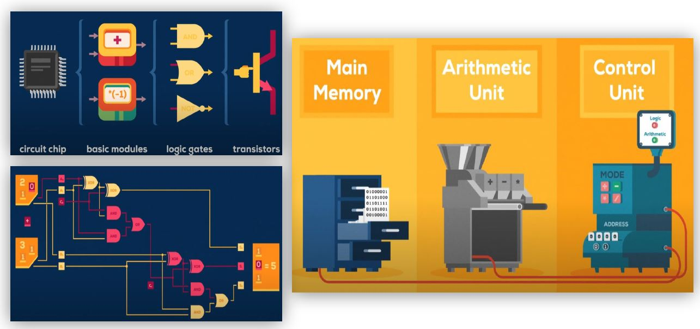
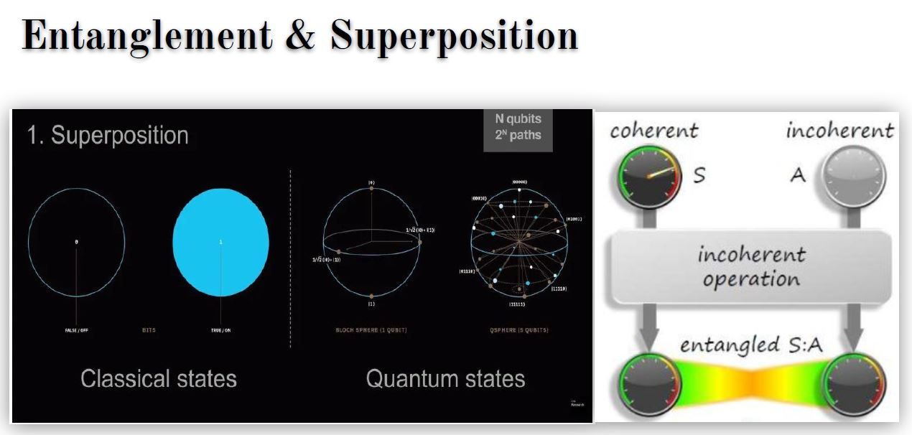
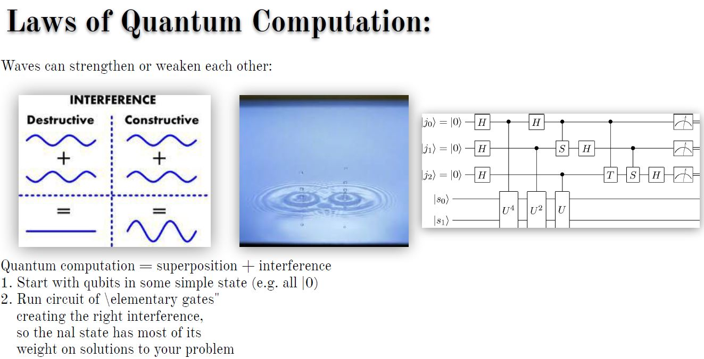
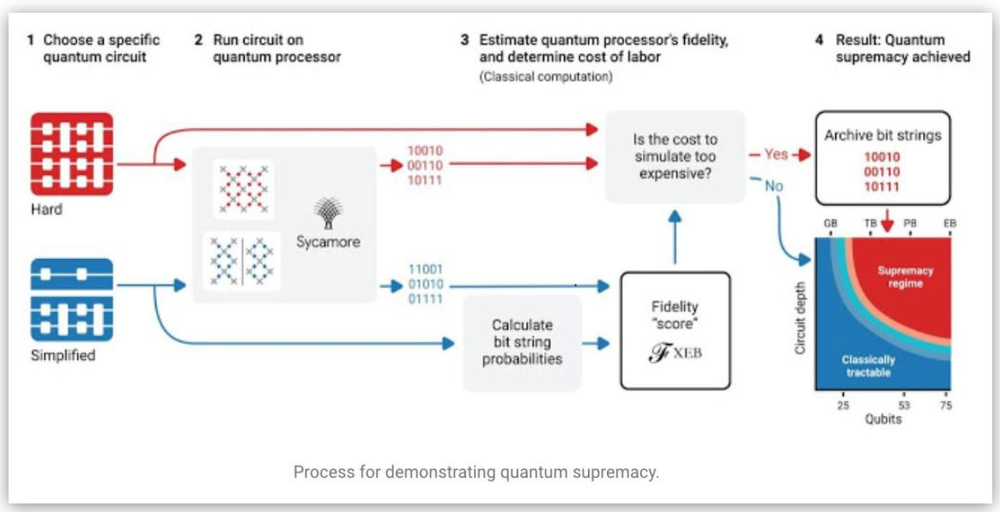

# Quantum Computing

Contents-

    1. Quantum von Neumann Architecture 
    2. Superconducting Quantum Computing
    3. Architecture 
    4. Ion Trap based Quantum Computers 
    5. D-Wave Quantum Computers 
    6. IBM Quantum Computers 
    7. Google Quantum Computers
 

# What is Quantum Computing?
The word "quantum", in quantum computer, originates from "quantum mechanics," a basic theory in physics.
In brief, on the scale of atoms and molecules, matter behaves in a quantum manner. A quantum computer is a
machine that performs calculations based on the laws of quantum mechanics, which is the behavior of
particles at the sub-atomic level.

# Properties of Quantum Computing
     → Superposition is essentially the ability of a quantum system to be in multiple states at the same time —
       that is, something can be “here” and “there,” or “up” and “down” at the same time.
     → Entanglement is the ability of quantum systems to exhibit correlations between states within a
       superposition.
     → Quantum Coherence deals with the idea that all objects have wave-like properties. Coherence also lies at
       the heart of quantum computing, in which a qubit is in a superposition of the "0" and "1" states, resulting in
       a speed-up over various classical algorithms.
     → Quantum interference, a byproduct of superposition, is what allows us to bias the measurement of a qubit
       toward a desired state or set of states
    

  
## Google Quantum Computers

# What is Supremacy?  
In quantum computing, quantum supremacy is the potential ability of devices to solve problems that classical computers practically cannot.

# Google’s process for demonstrating quantum supremacy

 
